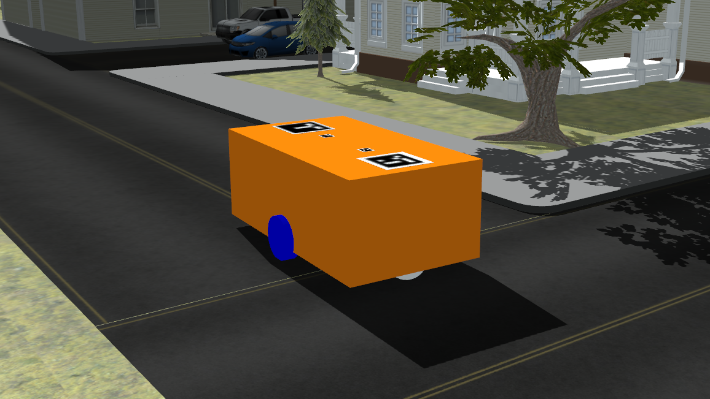

# twr_description

A ROS package that contains description of 2 wheeled robot platform with differential drive controller. 
This robot is written in URDF:xacro and has arucomarkers at the top of the platform. although this repository doesnt have the aruco material. 
If the material is in the gazebo_model_path, it will reflect in this model.
Currently rviz.launch and spawn.launch files will work, citysim.launch requires citysim.world file that is not a part of this repo either.

For a simple tutorial on the roots of this package check the following link out
https://karansinghkochar.com/Simple-sim-robot-for-ROS-Gazebo-8f6f01ef536c437eaac98a60111c4203

