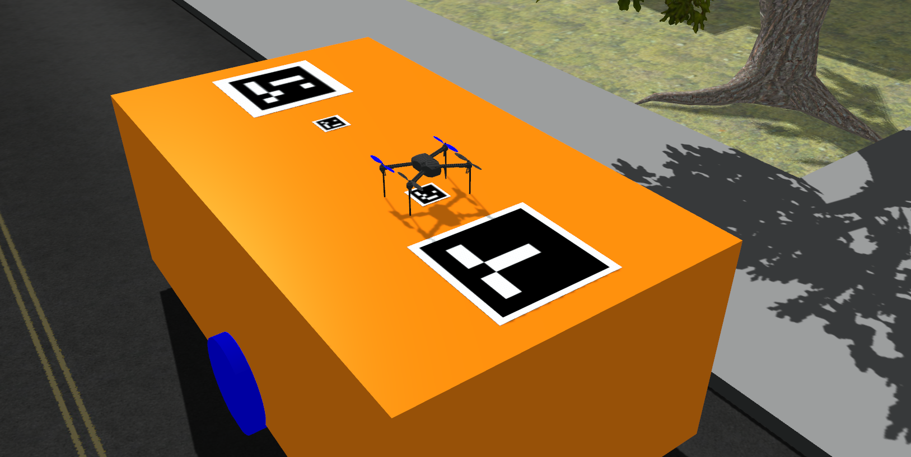

# 2 Wheel Robot Platform 
A ROS package that contains description of 2 wheeled robot platform with differential drive controller.

This robot is written in URDF:xacro and has arucomarkers at the top of the platform. Note: this repository doesnt have the aruco materials.
To make aruco material and citysim.world works on your system, clone the following folk: https://github.com/pyrotank41/ardupilot_gazebo.git

To use this package, make sure your workspace is setup like so
~~~
# from your root folder run the following in terminal 
mkdir -p simulator_ws/src
cd simulator_ws
catkin_make

~~~
To add the package to the workspace
~~~
cd src 
# clone the package
git clone https://github.com/pyrotank41/twr_description.git

# Important to create header files for ROS to recognize our package
cd ..
catkin_make
source devel/setup.bash

# launching our robot model
roslaunch twr_description empty_world.launch
~~~

To launch the model in **city sim** world.  
~~~
roslaunch twr_description citysim.launch
~~~

to launch the robot with iris arducopter
~~~
roslaunch twr_description citysim_iris.launch
~~~

For a simple tutorial on the roots of this package check the following link out
https://karansinghkochar.com/Simple-sim-robot-for-ROS-Gazebo-8f6f01ef536c437eaac98a60111c4203

